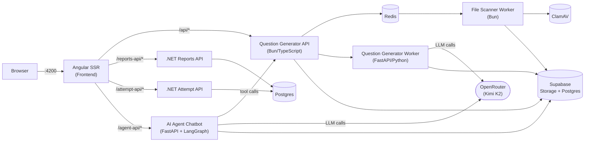

# Question Generator

An AI-powered assessment platform. Teachers upload a PDF, an LLM generates multiple-choice questions from it, and quizzes are published with a join code so students can attempt them under a countdown timer. Teachers get performance reports; an in-app AI agent chatbot can drive the whole generate → publish flow conversationally.

[](https://youtu.be/XttewcwoMR8)

*(click the thumbnail to watch the demo on YouTube)*

## Quick Start (Docker)

This is the fastest way to get every service running locally — no need to install Node, Bun, Python, or .NET yourself. Only Docker is required.

```bash
git clone https://github.com/akashjpal/question-generator.git
cd question-generator

cp .env.example .env
# open .env and fill in the required values (see "Environment Variables" below)

docker compose up --build
```

Once the build finishes, open **http://localhost:4200**.

To stop everything:

```bash
docker compose down
```

Useful variants:

```bash
docker compose up --build -d      # detached (background)
docker compose logs -f frontend   # tail logs for one service
docker compose up --build fastapi-worker  # (re)build just one service
```

### Required environment variables

Copy `.env.example` → `.env` and fill in at minimum:

| Variable | Purpose |
|---|---|
| `SUPABASE_URL`, `SUPABASE_SERVICE_ROLE_KEY`, `SUPABASE_BUCKET_ID` | Storage, auth, and Postgres database (all services) |
| `OPENROUTER_API_KEY` | LLM calls for question generation and the agent chatbot |
| `DATABASE_CONNECTION_STRING` | Postgres connection string used by the two .NET APIs |
| `REDIS_PASSWORD` | Password for the bundled Redis container |

Everything else in `.env.example` (model names, CORS origin, Phoenix tracing endpoint) has a sensible default and can be left as-is for local use. `PHOENIX_COLLECTOR_ENDPOINT` is optional — it's only used if you separately run an [Arize Phoenix](https://github.com/Arize-ai/phoenix) instance for LLM tracing; nothing breaks if you leave it out.

You'll need your own Supabase project (for Postgres + Storage + Auth) and an [OpenRouter](https://openrouter.ai/) API key — this repo doesn't include either.

## Architecture

The stack is intentionally polyglot: each service uses whatever runtime best fits its job. Everything is wired together with `docker-compose.yml`; the Angular SSR server is the only entry point exposed to your browser and reverse-proxies API calls to the backend services over the Docker network.

| Service | Directory | Language / Runtime | Role |
|---|---|---|---|
| Frontend | `ai-metimeter-client/` | Angular 21 (SSR, Node.js 22) | UI + reverse proxy to all backend APIs |
| Question Generator API | `question-generator-api-ts/` | TypeScript on **Bun** | Uploads, job orchestration, Supabase writes |
| Question Generator Worker | `question-generator-worker/` | Python 3.12 / FastAPI | PDF text extraction + LLM question generation |
| AI Agent Chatbot | `ai-agent-chatbot/` | Python 3.12 / FastAPI + LangGraph | Conversational agent that drives generation/publishing via tool calls |
| File Scanner Worker | `file-scanner-worker/` | Bun | Antivirus scanning of uploaded files (ClamAV) |
| Attempt API | `AttemptAPI/` | .NET 10 | Student quiz attempts and submissions |
| Reports API | `ReportsAPI/` | .NET 10 | Teacher-facing performance dashboards |
| Redis | — | Redis 7 | FIFO job queues (file scanning, generation status) |
| ClamAV | — | ClamAV | Virus scanning engine used by the file scanner worker |

All backend services communicate over the internal Docker network; only the frontend's port is published to your machine (`localhost:4200`). The frontend's SSR server (`server.ts`) proxies:

- `/api/*` → Question Generator API (Bun)
- `/reports-api/*` → Reports API (.NET)
- `/attempt-api/*` → Attempt API (.NET)
- `/agent-api/*` → AI Agent Chatbot (FastAPI/LangGraph)



### Data flow

**Question generation**
1. Frontend uploads a PDF → Question Generator API → Supabase Storage + Redis `scan_queue`.
2. File Scanner Worker scans it with ClamAV; infected files are deleted automatically.
3. Frontend requests question generation → Question Generator API creates a job row and hands off to the FastAPI worker.
4. The worker extracts text (PyMuPDF), calls the LLM via OpenRouter, saves generated MCQs to Supabase, and marks the job complete.
5. Frontend polls job status every 2s until it flips to completed/failed.

**Quiz attempts & reports**
- Students submit answers to the Attempt API (.NET); teachers view aggregated results via the Reports API (.NET).

**AI agent chatbot**
- A LangGraph-based agent (`ai-agent-chatbot/`) can perform the same generate → publish workflow through a chat interface, calling the Question Generator API's endpoints as tools and persisting chat sessions in Supabase.

### LLM provider

Both the question generator worker and the agent chatbot call **OpenRouter** (OpenAI-compatible API), defaulting to `moonshotai/kimi-k2`. This is configured via `OPENROUTER_API_KEY` / `OPENROUTER_MODEL` / `AGENT_OPENROUTER_MODEL` in `.env`.

## Running services individually (without Docker)

Useful for active development on a single service. See `CLAUDE.md` for the full per-service command reference (install steps, dev servers, ports). In short:

```bash
# Frontend
cd ai-metimeter-client && npm install && npm run dev

# Question Generator API (Bun)
cd question-generator-api-ts && bun install && bun --watch index.ts

# Question Generator Worker (Python/FastAPI)
cd question-generator-worker && python -m venv .venv && source .venv/Scripts/activate
pip install -r requirements.txt && uvicorn main:app --reload --port 8000

# AI Agent Chatbot (Python/FastAPI + LangGraph)
cd ai-agent-chatbot && python -m venv .venv && source .venv/Scripts/activate
pip install -r requirements.txt && python run_dev.py

# .NET APIs
cd AttemptAPI  && dotnet restore && dotnet run
cd ReportsAPI  && dotnet restore && dotnet run

# File Scanner Worker
cd file-scanner-worker && bun install && bun consumer.js
```

When running services outside Docker, point each service's `*_URL` environment variables at `localhost` and the relevant port instead of the Docker service name (see the comments in `ai-metimeter-client/src/server.ts`).
