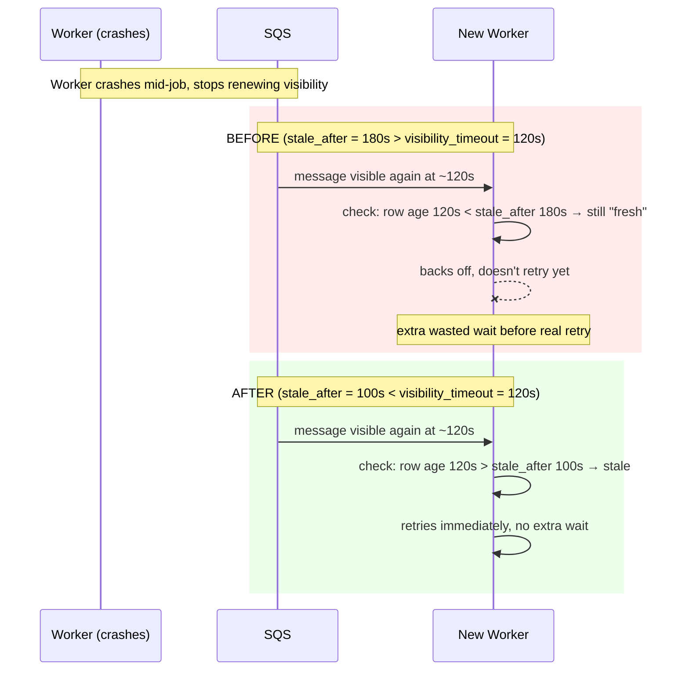

# Stale-After Fix — Walkthrough

## What was broken

When a worker crashes mid-job, `question-worker` has a safety check meant to
notice the abandoned job and let a new worker retry it. That check compares
how long ago the job's database row was last touched (`updated_at`) against
a threshold called `stale_after` — if it's been longer than that, the job is
assumed dead and safe to retry.

The bug: `stale_after` was calculated as **180 seconds**, but SQS itself
only keeps a message hidden from other workers for **120 seconds**
(`visibility_timeout`). Since 180 > 120, the very first time SQS naturally
handed the crashed job's message to a new worker (at ~120s), that worker's
freshness check still said "too recent, might still be alive" — so it
backed off instead of retrying, adding an extra, unnecessary wait on top of
the crash recovery time.

## What changed

`stale_after` is now derived *from* the SQS visibility timeout instead of
from an unrelated setting, with a small safety margin:

```
stale_after = visibility_timeout − 20s   (with a 30s floor)
```

With the default 120s visibility timeout, that's now **100s** — always
comfortably below 120s, so the check never disagrees with SQS's own timing
again. If the visibility timeout is ever tuned later, `stale_after` adjusts
with it automatically instead of needing a second, separate change.

## Before vs. after



## One more thing found along the way

While getting the test suite to actually finish (it was hanging on an
unrelated issue in a test's fake SQS client — fixed separately, see
`RCA_Bug_QuestionWorkerSkipReasonDroppedFromState.md` for that plus a second,
real bug it uncovered), all 48 tests were confirmed passing, including new
tests specifically covering this fix's boundary conditions (default timeout,
a custom timeout, and the floor for a very small timeout).
