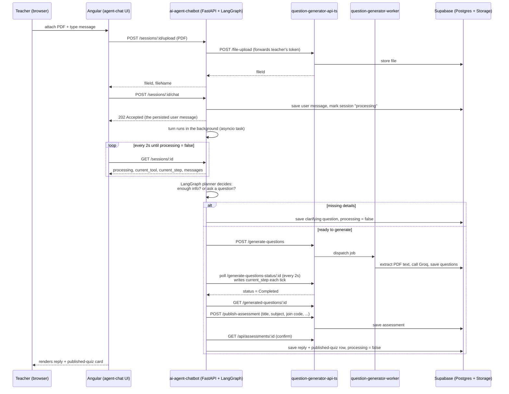
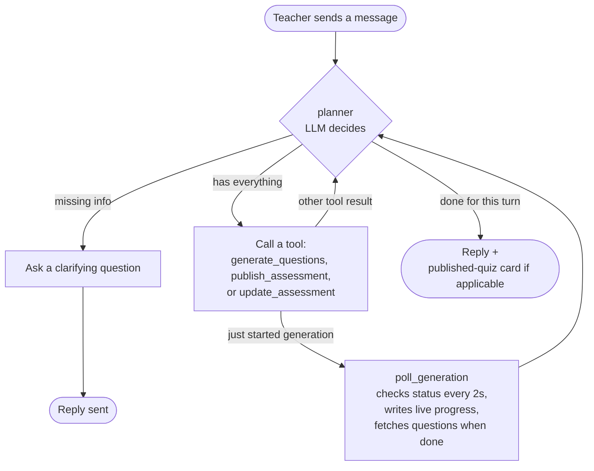
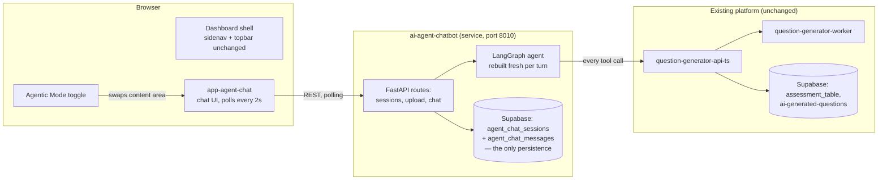

# Agentic Chatbot — Walkthrough

## What was built

A teacher can flip an **"Agentic Mode"** switch in the dashboard. The page
swaps from the normal quiz list/reports view to a chat window. The teacher
attaches a PDF and describes the quiz they want in plain language; a backend
service — `ai-agent-chatbot/` (Python, FastAPI + LangGraph) — drives the
rest: it asks for any missing details, generates the questions, publishes
the quiz, hands back a link + join code students can use immediately, and
can also update a published quiz's title/subject/topic/difficulty/
description/time limit on request.

Everything the agent does goes through the **existing** `question-generator-api-ts`
service — it doesn't reimplement upload/generate/publish logic, it just calls
those endpoints on the teacher's behalf, the same way the existing manual
wizard does.

> This doc was rewritten after a simplification pass: the original build used
> a LangGraph Postgres checkpointer *and* separate Supabase tables to persist
> chat state (two write paths for the same thing), and streamed replies over
> SSE. Both were replaced — see "What changed in the simplification pass"
> below — with a single Supabase-backed persistence path and a polling
> contract the frontend already uses elsewhere in this app.

## How a request flows through the system

Updating a published quiz (`"change the time limit to 20 minutes"`) follows
the same request/poll shape — the agent calls `update_assessment`, which
fetches the current assessment, overlays only the changed fields, and calls
the existing `POST /update-assessment` endpoint.

## The agent's decision loop (LangGraph)

The agent isn't a single LLM call — it's a small state machine, rebuilt fresh
on every turn (no checkpointer — see below). One step, polling generation
status, is deliberately **not** left to the LLM to decide when to do — it
always happens automatically once generation starts, because there's no real
judgment call involved, only waiting.

## Where things live

## Key design choices, and why

- **The agent calls the existing TS API instead of talking to Supabase/Gemini
  directly.** One place owns "how a quiz gets published" — no second copy of
  that logic to keep in sync.
- **No checkpointer — agent state is rebuilt from Supabase on every turn.**
  The original build persisted chat state twice: once via a LangGraph
  Postgres checkpointer, once via Supabase tables for the UI. That's gone —
  `agent/state.py` reconstructs everything the LLM needs (conversation
  history, in-flight generation job, fetched questions, the last published
  assessment id) straight from `agent_chat_messages`/`agent_chat_sessions`
  each time. One persistence path, no Windows-specific event-loop
  workarounds, no duplicate schema.
- **The frontend polls, it doesn't stream.** `POST /sessions/:id/chat`
  answers immediately (202) and the turn runs in the background; the
  frontend polls `GET /sessions/:id` every 2s — the same `timer(0,2000)` +
  `switchMap` + `takeWhile` pattern already used elsewhere in this app for
  question-generation status — until `processing` goes back to `false`.
  `current_tool`/`current_step` on that response show live progress
  ("Calling generate_questions…", "Generating questions… (attempt 12/150)").
  This replaced a hand-rolled SSE client (`fetch()` + `ReadableStream` +
  manual frame parsing, needed only because native `EventSource` can't send
  an auth header) with plain `HttpClient` calls that go through the app's
  normal auth interceptor.
- **Polling and question-fetching are automatic, not LLM tool calls.** There's
  no decision to make while waiting for generation to finish — making the LLM
  "decide" to check again would just burn time and tokens for no benefit.
- **The teacher's login token never gets saved to the database.** Chat history
  is saved (so a refresh doesn't lose your conversation), but the token is
  passed around only in memory for the duration of one request — never
  written into a persisted table.
- **The single help/FAQ file, not a search system.** The document that grounds
  the assistant (what info it needs, how joining a quiz works, etc.) is one
  short markdown file, given to the assistant in full every time. A
  full-blown search-and-retrieve system was considered and explicitly not
  used — with content this small, it would add complexity without a real
  benefit, revisit only if the docs grow much larger.
- **A refreshed page picks up mid-conversation.** Because the conversation's
  progress is saved to the database as it goes (not just at the end),
  navigating away and coming back doesn't lose an in-progress "generate this
  quiz" flow — the frontend sees `processing: true` on load and re-arms
  polling.
- **Editing a published quiz is metadata-only.** `update_assessment` can
  change title/subject/topic/difficulty/description/time limit, but not
  individual question text/options/answers — that keeps the tool simple
  (fetch current assessment, overlay changed fields, re-send) with no
  question-list diffing logic.

## What changed in the simplification pass

| Removed | Replaced with |
|---|---|
| LangGraph `AsyncPostgresSaver` Postgres checkpointer (+ its own schema, Windows event-loop workaround, `.NET`-connection-string parsing) | Fresh `AgentState` rebuilt from Supabase rows every turn (`agent/state.py`) |
| SSE (`sse_starlette`, hand-rolled `fetch()`/`ReadableStream` frame parser on the frontend, dual auth-token path) | `POST /sessions/:id/chat` → 202, frontend polls `GET /sessions/:id` (`processing`/`current_tool`/`current_step`) |
| No-op `intake`/`responder` graph nodes | `START -> planner`, routes straight to `END` |
| — | New `update_assessment` tool (metadata-only) |

## What's new, file by file (high level)

| Area | What changed |
|---|---|
| `ai-agent-chatbot/` | FastAPI app, the LangGraph agent (3 tools: `generate_questions`, `publish_assessment`, `update_assessment`), chat storage, help doc. |
| `question-generator-api-ts/` | One small endpoint used by the agent: check whether a join code is already taken (`GET /assessment-code-available/:code`) — needed since the agent runs unattended. `update-assessment` already existed and is now also called by the agent. |
| `ai-metimeter-client/` | "Agentic Mode" toggle + chat components; polling-based `AgentChatService`; small additions to existing proxy/auth wiring so the browser can reach the new service. |
| `docker-compose.yml`, `.env.example` | Service registered, environment variables documented (no `DATABASE_CONNECTION_STRING` needed by this service anymore). |

## What's verified vs. what still needs real credentials

**Verified in this environment** (dependencies actually installed, code
actually executed):
- Every Python module imports cleanly, the LangGraph agent builds, and its
  topology was inspected directly (`planner`/`tools`/`poll_generation` only —
  no leftover `intake`/`responder`).
- The state-rebuild-from-rows algorithm, the graph's routing logic, and the
  `update_assessment` tool's metadata-overlay behavior are covered by unit
  tests, including one that exercises the real LangChain `ToolCall`
  invocation shape for a tool using `InjectedState`/`InjectedToolCallId`.
- 30 Python tests pass (`pytest`), 82 Angular tests pass (`ng test`), zero
  regressions in the existing suite.
- The Angular app builds cleanly (browser + server-rendered bundles).

**Also verified**: the agent's LLM was switched from Groq (`llama-3.3-70b-versatile`)
to Gemini (`gemini-2.5-flash` via `langchain-google-genai`) — confirmed with real
API calls against the configured `GEMINI_API_KEY`: a plain chat completion, and a
tool-calling turn where Gemini correctly selected `generate_questions` with
well-formed args in the exact `ToolCall` shape LangGraph's `ToolNode`/
`InjectedState` expects.

**Not verified here** (would need a running `question-generator-api-ts` +
real Supabase data, not available in this environment):
- A full `generate_questions → poll → publish_assessment → update_assessment`
  chain against the live TS API.
- The Supabase-backed chat history and live-progress polling working
  end-to-end against a real deployment.

`ai-agent-chatbot/scripts/chat_cli.py` is a ready-made terminal harness for
exactly this — it also doubles as a smoke test of the state-rebuild
algorithm, since it accumulates its own local message log across turns just
like `agent/runner.py` does per HTTP request. Run it with a real `.env` and a
real Supabase login token to validate the full pipeline before it's used for
real.

## What's left

- Manual end-to-end pass against real credentials (see above), including a
  mid-turn page refresh to confirm polling re-arms correctly.
- Running the updated `migrations/001_agent_chat_tables.sql` against the
  Supabase project (adds `processing`/`current_tool`/`current_step` columns).
- Visual/UX check of the chat UI in a running browser (layout was verified to
  compile, not visually inspected).
