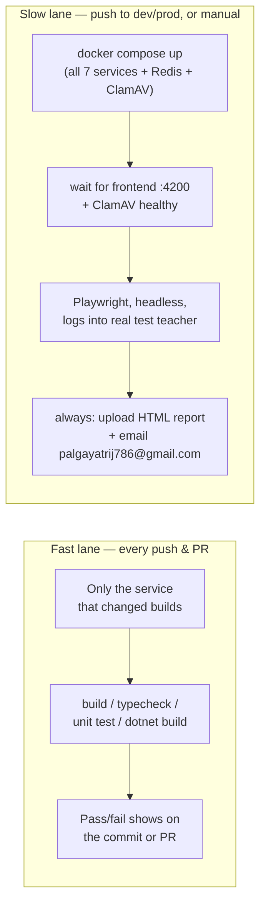

# CI Pipeline — Walkthrough

## What was built

Eight GitHub Actions workflows in `.github/workflows/`:

1. `ci-client.yml` — Angular client
2. `ci-question-generator-api.yml` — Bun/TS API
3. `ci-question-generator-worker.yml` — Python/FastAPI worker
4. `ci-file-scanner-worker.yml` — Bun file scanner
5. `ci-attempt-api.yml` — .NET AttemptAPI
6. `ci-reports-api.yml` — .NET ReportsAPI
7. `ci-ai-agent-chatbot.yml` — Python/FastAPI agent
8. `e2e-playwright.yml` — full-stack headless Playwright suite + email

## Two kinds of pipeline, two different jobs

Think of this as a **fast lane** and a **slow lane**:

**Why two lanes instead of one:** the fast lane needs no secrets and costs
nothing — it just proves each service still compiles and its own tests pass.
The slow lane is expensive (it spins up 7 containers, logs into a real
Supabase account, and some specs make real OpenRouter/LLM calls that cost
money), so it only runs when code actually reaches `dev`/`prod`, or when you
trigger it by hand from the Actions tab.

## Fast lane: path filtering keeps jobs independent

Each of the 7 non-e2e workflows has `paths:` filters scoped to its own
service directory. A change to `ReportsAPI/` never triggers a rebuild of the
Angular client, and vice versa — each service's CI status is visible and
attributable on its own.

| Service | No test suite exists → what CI checks instead |
|---|---|
| `question-generator-api-ts` | `tsc --noEmit` (type-check only) |
| `question-generator-worker` | `python -m compileall` (syntax-only — importing the real modules needs live Supabase credentials, see below) |
| `file-scanner-worker` | `node --check` (syntax-only) |
| `AttemptAPI` / `ReportsAPI` | `dotnet build` (no test project checked in) |

`ai-metimeter-client` (Vitest) and `ai-agent-chatbot` (pytest) have real,
already-passing test suites, so those run for real.

## Slow lane: why it needs to boot the whole stack

The Playwright suite (already on this branch, under
`ai-metimeter-client/e2e/`) doesn't mock anything — `global-setup.ts` logs in
through the real login form against a **dedicated Supabase test teacher
account**, and some specs drive actual LLM-backed flows. That only works if
every backend service is up, so the workflow:

1. Writes the repo-root `.env` from GitHub secrets, then `docker compose up --build -d` — the exact same command you'd run locally.
2. Waits for two things specifically: the frontend answering on `:4200`, **and** the ClamAV container reporting `healthy` (it has a 60s startup window) — file-upload specs would flake without that second check.
3. Installs Playwright's headless Chromium (`--with-deps` pulls the Linux system libraries it needs) and runs `npm run test:e2e`.
4. **Always** (pass or fail) uploads the HTML report as a workflow artifact, then emails `palgayatrij786@gmail.com` via Gmail SMTP — subject line says PASSED/FAILED, body links to the run, and the zipped report is attached directly when it's small enough (report is skipped from the email, not the run, if it's over 15MB — you'd grab it from the artifact instead).
5. **Always** tears the stack down (`docker compose down -v`), even if an earlier step failed.

## What you need to do before this runs

Add these under **repo Settings → Secrets and variables → Actions**:

**For the e2e job to talk to real services:**
- `SUPABASE_URL`, `SUPABASE_SERVICE_ROLE_KEY`, `SUPABASE_BUCKET_ID`
- `OPENROUTER_API_KEY`
- `REDIS_PASSWORD`
- `DATABASE_CONNECTION_STRING`
- `TEST_TEACHER_EMAIL`, `TEST_TEACHER_PASSWORD` — must be a dedicated
  Supabase test account, never a real teacher's, per the existing
  `.env.test.example` warning

**For the email:**
- `SMTP_USERNAME` — a Gmail address
- `SMTP_PASSWORD` — a 16-character **App Password** for that Gmail account
  (requires 2-Step Verification turned on; generate at
  myaccount.google.com → Security → App passwords)

The recipient (`palgayatrij786@gmail.com`) is hardcoded in the workflow
since it isn't sensitive.

The 7 fast-lane workflows need **no secrets** — they'll start working the
moment this is merged.

## Deliberately out of scope
- No Docker image publishing / deployment (CD). This is validation CI only —
  say the word if you want images pushed to a registry on merge to `prod`.
- No `.NET` test projects were added since none exist in the repo today —
  CI only proves the code builds. If you want real xUnit/NUnit coverage for
  `AttemptAPI`/`ReportsAPI`, that's a separate piece of work.
